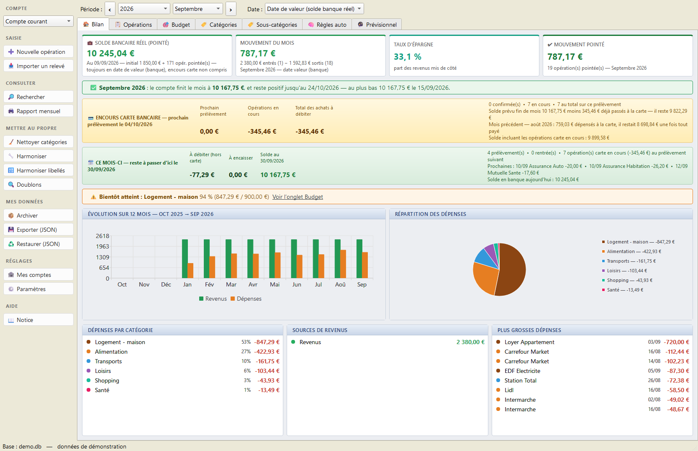
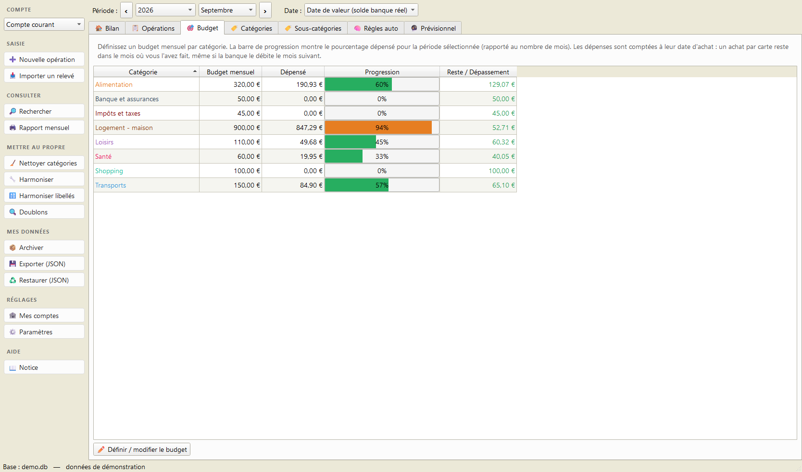
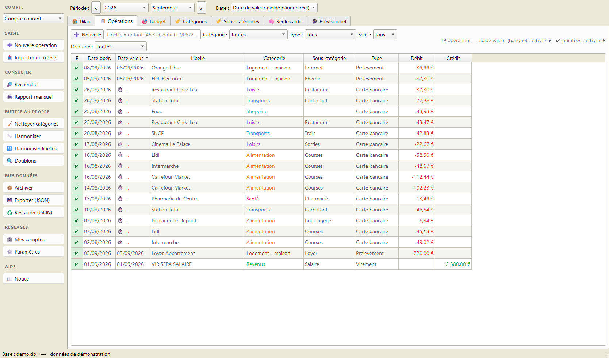
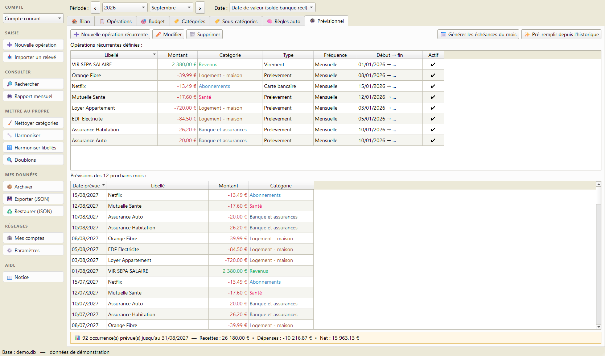
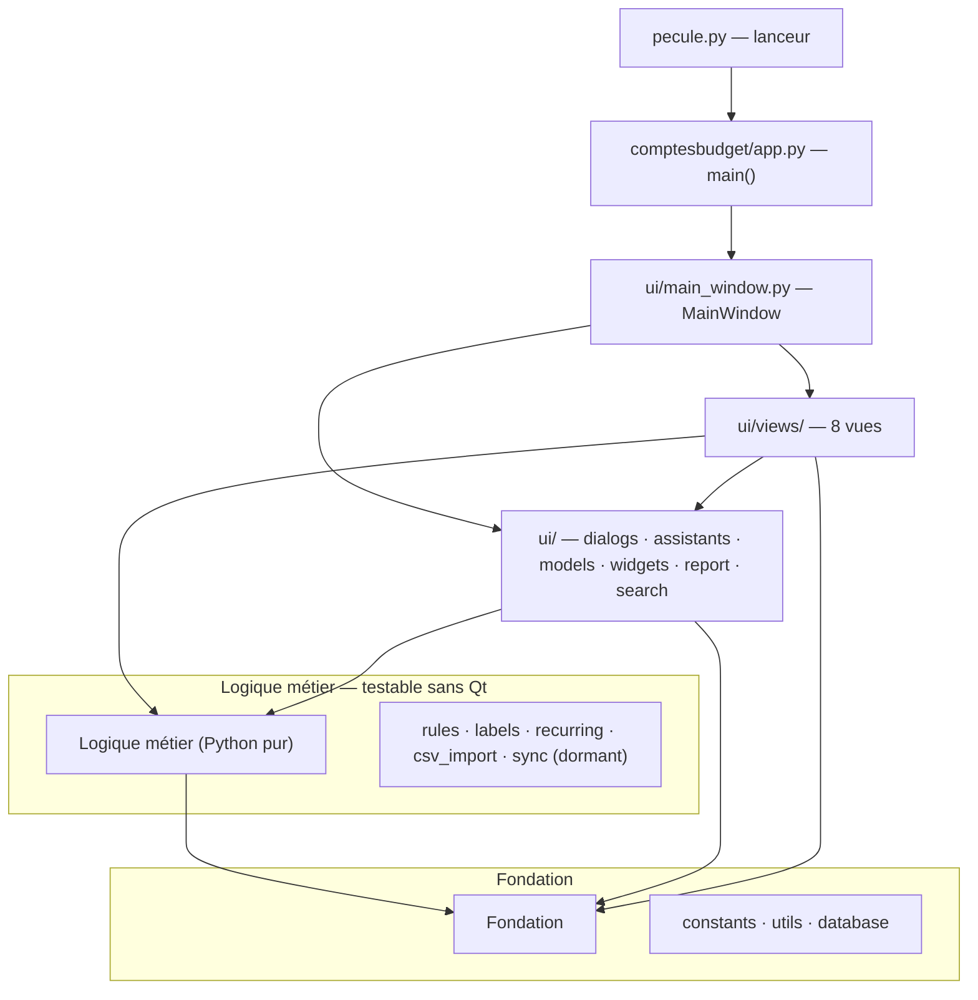

# Pécule

**Français** · [English](#-english--personal-accounting-and-budgeting-for-windows)

[](https://github.com/andre12230-png/Pecule/releases)
[](https://github.com/andre12230-png/Pecule/releases/latest)
[](LICENSE)

> 📥 **Télécharger pour Windows 10/11** — [page de présentation](https://andre12230-png.github.io/Pecule/) · [dernière version (.zip)](https://github.com/andre12230-png/Pecule/releases/latest)

> 📦 Ou en ligne de commande avec **[Scoop](https://scoop.sh)** : `scoop install https://raw.githubusercontent.com/andre12230-png/Pecule/main/bucket/pecule.json`

Application de bureau pour la **gestion de comptes et de budget personnels** :
suivi des opérations, catégorisation automatique, budgets mensuels, prévisionnel
des opérations récurrentes, rapports et rapprochement bancaire.

Interface **PySide6 (Qt)**, données stockées en **SQLite** local. C'est un portage
Python d'une ancienne application HTML/JS.

> Version applicative : **1.23.2**

---

## Aperçu

| | |
|:---:|:---:|
|  |  |
|  |  |

*Captures réalisées avec des données d'exemple.*

---

## 🇬🇧 English — personal accounting and budgeting for Windows

**Pécule** (French for "nest egg") is a free, open-source desktop application
for tracking personal bank accounts and budgets. It is built with **PySide6 (Qt)** and stores
everything in a **local SQLite** file: no account to create, no cloud, no
telemetry — your financial data never leaves your computer.

**What it does**

- **Transactions** — filterable ledger with reconciliation (cleared/uncleared), inline editing and duplicate detection
- **Budgets** — monthly per-category budgets with progress bars and overspend alerts
- **Auto-categorisation** — user-defined rules (pattern → category) applied on import
- **Recurring & forecast** — model recurring transactions, project the coming months, and pre-generate the current month's expected entries; each one is later *completed* by the real bank line at import time instead of creating a duplicate
- **CSV import** — French bank statement exports; columns are matched by name, so no bank-specific setup (semicolon-separated, windows-1252 or UTF-8)
- **Reports** — printable / PDF monthly report, dashboard with KPIs and charts, global search
- **Automatic daily backup** of the database

**Install**

```bash
pip install PySide6
python pecule.py
```

Windows users can instead download the standalone `.exe`
([latest release](https://github.com/andre12230-png/Pecule/releases/latest))
or install via [Scoop](https://scoop.sh):

```bash
scoop install https://raw.githubusercontent.com/andre12230-png/Pecule/main/bucket/pecule.json
```

Requires Python ≥ 3.9 (developed and tested on 3.13 / 3.14). Licensed under
**MIT**. Windows 10/11 is the primary target, but the code is pure Python + Qt
and runs on Linux and macOS.

> ℹ️ **Note:** the user interface, the built-in manual and the rest of this
> README are in **French**. The CSV importer is tuned for French bank exports.
> Contributions towards internationalisation are welcome — see
> [Issues](https://github.com/andre12230-png/Pecule/issues).

---

## Fonctionnalités

L'application s'organise en onglets :

| Onglet | Rôle |
|---|---|
| 🏠 **Bilan** | Tableau de bord : soldes, KPIs, alertes budget, graphiques, top dépenses |
| 📋 **Opérations** | Liste filtrable des transactions, pointage, édition, doublons |
| 🎯 **Budget** | Budgets par catégorie avec barres de progression |
| 🏷️ **Catégories** | Exploration par catégorie (drill-down), recatégorisation en masse |
| 🏷️ **Sous-catégories** | Tri, fusion, renommage, nettoyage des sous-catégories |
| 🧠 **Règles auto** | Règles de catégorisation automatique (motif → catégorie) |
| 🔮 **Prévisionnel** | Opérations récurrentes, projection des prochains mois et **génération des échéances du mois** |
| 📖 **Notice** | Mode d'emploi et glossaire intégrés |

Autres outils : **import CSV** des relevés bancaires (BPCE / CM / CA, encodage
windows-1252), **harmonisation** des catégories et libellés, **recherche globale**
(Ctrl+F), **rapport mensuel** imprimable / PDF, et **sauvegarde quotidienne
automatique** de la base.

### Saisir d'avance les échéances du mois

Le bouton **📅 Générer les échéances du mois** (onglet Prévisionnel) crée en une
fois les opérations attendues du mois d'après vos récurrences. Elles sont
enregistrées **non pointées** et marquées ⏳ : elles apparaissent dans la liste
et dans « ce qui est prévu », mais ne pèsent pas sur le solde en banque.

À l'import du relevé, chacune est **complétée** par la ligne réelle de la banque
— date, montant, libellé d'origine, référence, pointage — au lieu de créer un
doublon, avec une tolérance de 7 jours et deux modes de reconnaissance : même
montant, ou libellé concordant (pour les factures à montant variable). Votre
libellé et votre catégorie sont conservés.

Le Bilan résume tout cela dans le bandeau **🗓 Ce mois-ci** : reste à débiter,
reste à encaisser et **solde prévu au dernier jour du mois**.

---

## Installation et lancement

**Prérequis :** Python ≥ 3.9 (les annotations `list[...]` l'exigent ; développé
et testé avec 3.13 / 3.14) et la dépendance **PySide6**.

```bash
pip install PySide6
```

**Lancer l'application :**

```bash
python pecule.py
```

Sous Windows, on peut aussi double-cliquer sur
[`Lancer-Pecule.bat`](Lancer-Pecule.bat) (utilise `pythonw.exe`
pour éviter la console noire), ou lancer le package directement :

```bash
python -m comptesbudget
```

---

## Construction d'un exécutable autonome

Le script [`Construire-Exe.bat`](Construire-Exe.bat) produit un `.exe` autonome
(~100 Mo) via **PyInstaller** :

```bash
python -m PyInstaller --noconfirm --onefile --windowed ^
    --name "Pecule" --icon Budget.ico --add-data "Budget.ico;." ^
    --collect-submodules PySide6 pecule.py
```

Le point d'entrée reste `pecule.py` : PyInstaller suit l'import du package
et embarque automatiquement tout `comptesbudget/`.

---

## Architecture du projet

Le code est organisé en un **lanceur léger** (`pecule.py`) et un **package
`comptesbudget/`** découpé en couches. Les dépendances sont **strictement
descendantes (graphe acyclique)** : l'interface dépend de la logique, qui dépend
de la fondation — jamais l'inverse.



### Arborescence

```
pecule.py            Lanceur (point d'entrée des .bat et de PyInstaller)
comptesbudget/
├── __init__.py
├── __main__.py              Permet « python -m comptesbudget »
├── app.py                   main() : QApplication, palette, lancement
│
│   ── Fondation (Python pur, sans Qt) ──
├── constants.py             Catégories, couleurs, règles d'harmonisation,
│                            fréquences, chemins, numéro de version
├── utils.py                 Dates, formatage €, normalisation, sauvegarde
├── database.py              class Database (schéma + accès SQLite)
│
│   ── Logique métier (Python pur, sans Qt) ──
├── rules.py                 Auto-catégorisation (matches_rule, apply_rules_to_tx)
├── labels.py                Nettoyage et profilage des libellés
├── recurring.py             Occurrences récurrentes + détection automatique
├── csv_import.py            Import des relevés bancaires CSV
├── sync.py                  Moteur de fusion (LWW) — DORMANT, conservé
│
└── ui/                      ── Interface (PySide6/Qt) ──
    ├── models.py            TxTableModel (modèle de table)
    ├── widgets.py           PeriodBar (sélecteur de période)
    ├── dialogs.py           Édition : transaction, réglages, règle, récurrence
    ├── assistants.py        Harmonisation, pré-remplissage du prévisionnel
    ├── report.py            Rapport mensuel (HTML, aperçu, PDF, impression)
    ├── search.py            Recherche globale (Ctrl+F)
    ├── main_window.py       MainWindow : assemble onglets et menu d'actions
    └── views/
        ├── operations.py    Vue Opérations
        ├── bilan.py         Vue Bilan
        ├── budget.py        Vue Budget
        ├── categories.py    Vue Catégories
        ├── subcategories.py Vue Sous-catégories
        ├── previsionnel.py  Vue Prévisionnel
        ├── rules_view.py    Vue Règles auto
        └── notice.py        Vue Notice

outils/
├── captures_promo.py       Refabrique les captures de docs/media/ à partir
│                           d'une base de démonstration inventée
└── faire_archive.py        Fabrique le .zip de la release et son empreinte
```

Pour refaire les captures de la page de présentation après un changement
d'interface :

```bash
python outils/captures_promo.py
```

Le script fabrique une base de démonstration dans un dossier temporaire,
photographie les quatre onglets de la vitrine, puis efface cette base. Aucune
donnée réelle n'y figure, et votre `comptes.db` n'est jamais ouverte.

Pour préparer une release, après `Construire-Exe.bat` :

```bash
python outils/faire_archive.py
```

Il ajoute `Lisez-moi.txt` et `Budget.ico` au dossier construit, écrit le `.zip`
puis affiche l'empreinte SHA-256 à reporter dans `bucket/pecule.json`.

**Ne fabriquez pas ce `.zip` avec le clic droit de Windows.** `Compress-Archive`
écrit les entrées de dossier sans le marqueur « répertoire » : un outil strict
y voit un fichier vide en conflit avec le dossier du même nom et refuse
l'archive, alors que Windows l'extrait sans rien signaler. Le script n'écrit
que des fichiers, et vérifie l'archive produite avant de rendre la main.

### Couches

1. **Fondation** (`constants`, `utils`, `database`) — données de configuration,
   utilitaires et accès SQLite. Aucune dépendance vers le reste.
2. **Logique métier** (`rules`, `labels`, `recurring`, `csv_import`, `sync`) —
   pur Python, **testable sans interface graphique**. Ne dépend que de la fondation.
3. **Interface** (`ui/`) — widgets, dialogues et vues PySide6. La fenêtre
   principale assemble les huit vues ; aucune vue n'en instancie une autre.

---

## Données et fichiers

Tout est stocké **à côté du lanceur** (ou de l'`.exe` en mode gelé) :

| Fichier / dossier | Contenu | Versionné ? |
|---|---|---|
| `comptes.db` | Base SQLite (opérations, budgets, règles, récurrences, réglages) | non (données perso) |
| `sauvegardes/` | Copies quotidiennes automatiques de la base (rotation sur 10 jours) | non |
| `comptes_sync.json` | Fichier d'échange historique (lié au moteur dormant `sync.py`) | non |
| `Budget.ico` | Icône de l'application | oui |

La sauvegarde quotidienne est effectuée **au lancement, avant l'ouverture de la
base** : même une migration ratée ne peut pas abîmer la copie du jour.

---

## Notes de développement

- **Module `sync.py` dormant** : le moteur de fusion par enregistrement
  (*last-write-wins*) n'est plus câblé à l'interface depuis la v1.9.5 (retrait de
  l'app HTML et de sa synchronisation). Il est conservé pour pouvoir
  réimporter / fusionner un fichier d'échange JSON si besoin.
- **Couche métier testée** : `rules`, `labels`, `recurring`, `csv_import` et
  `database` s'importent et s'exécutent sans Qt. Une suite de tests unitaires
  (`tests/`) couvre le formatage, l'auto-catégorisation, les occurrences
  récurrentes, le nettoyage des libellés et l'import CSV (dédoublonnage compris).
  La couche UI (PySide6) est couverte par des *smoke tests* : chaque vue et
  dialogue est construit en mode « offscreen » puis rafraîchi, pour détecter
  les plantages et erreurs de câblage sans serveur d'affichage.

  ```bash
  pip install -r requirements-dev.txt
  pytest
  ```
- **Qualité** : le code passe `ruff` (jeu de règles *pyflakes* F : aucun import
  manquant, aucun nom non défini, aucun import inutilisé).

  ```bash
  ruff check comptesbudget
  ```

---

## Licence

Distribué sous licence **MIT** — voir le fichier [`LICENSE`](LICENSE). Vous êtes
libre d'utiliser, modifier et redistribuer ce logiciel, y compris à des fins
commerciales, à condition de conserver la mention de copyright.

> ⚠️ **Confidentialité** : aucune donnée personnelle n'est incluse dans ce dépôt.
> La base `comptes.db` est créée vide au premier lancement et reste sur votre
> machine. Elle n'est jamais versionnée (voir `.gitignore`).
