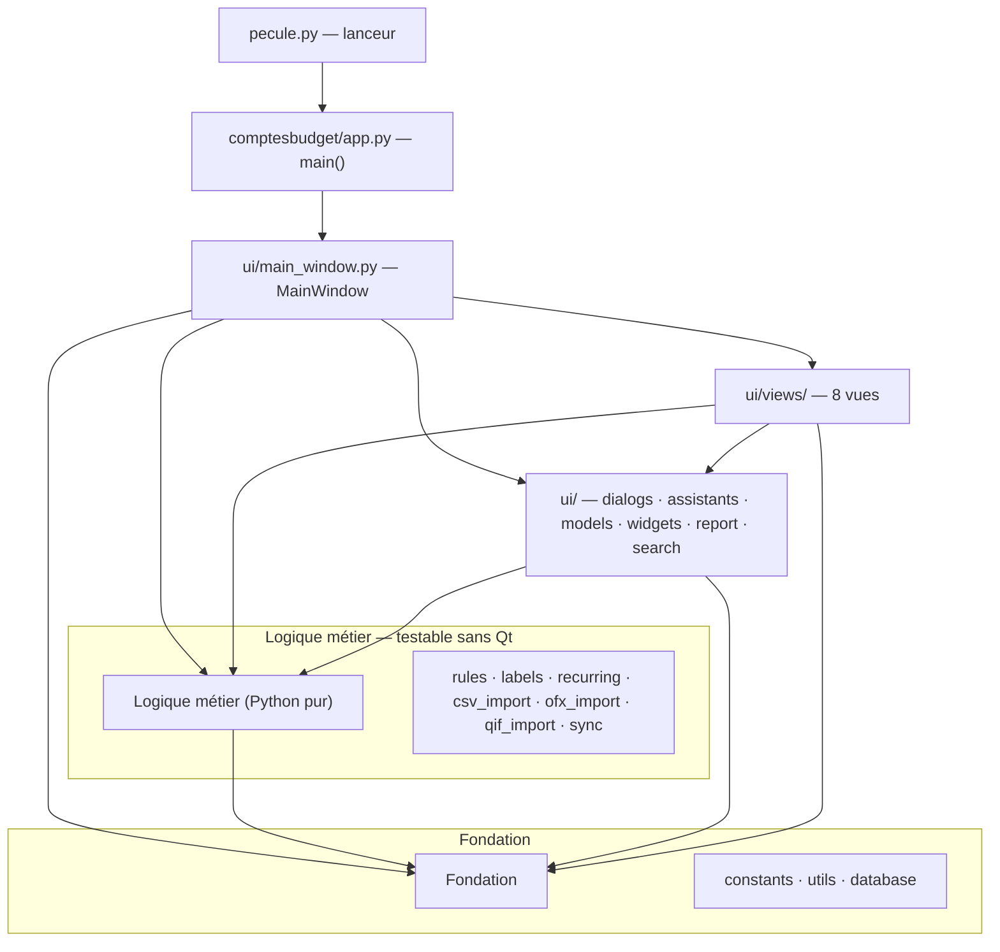

# Pécule

**Français** · [English](#-english--personal-accounting-and-budgeting-for-windows)

[](https://github.com/andre12230-png/Pecule/releases)
[](https://github.com/andre12230-png/Pecule/releases/latest)
[](LICENSE)

> 📥 **Télécharger pour Windows 10/11** — [page de présentation](https://andre12230-png.github.io/Pecule/) · [dernière version (.zip)](https://github.com/andre12230-png/Pecule/releases/latest)

> 📦 Ou en ligne de commande avec **[Scoop](https://scoop.sh)** : `scoop install https://raw.githubusercontent.com/andre12230-png/Pecule/main/bucket/pecule.json`
>
> ⏳ Un paquet **Winget** est [soumis et en attente de revue](https://github.com/microsoft/winget-pkgs/pull/416272) : `winget install` ne le connaît pas encore.

Application de bureau pour la **gestion de comptes et de budget personnels** :
suivi des opérations, catégorisation automatique, budgets mensuels, prévisionnel
des opérations récurrentes, rapports et rapprochement bancaire.

Interface **PySide6 (Qt)**, données stockées en **SQLite** local. C'est un portage
Python d'une ancienne application HTML/JS.

> Version applicative : **1.26.0**

---

## Aperçu

| | |
|:---:|:---:|
|  |  |
|  |  |

*Captures réalisées avec des données d'exemple.*

---

## 🇬🇧 English — personal accounting and budgeting for Windows

**Pécule** (French for "nest egg") is a free, open-source desktop application
for tracking personal bank accounts and budgets. It is built with **PySide6 (Qt)** and stores
everything in a **local SQLite** file: no account to create, no cloud, no
telemetry — your financial data never leaves your computer.

**What it does**

- **Transactions** — filterable ledger with reconciliation (cleared/uncleared), inline editing and duplicate detection
- **Budgets** — monthly per-category budgets with progress bars and overspend alerts
- **Auto-categorisation** — user-defined rules (pattern → category) applied on import
- **Recurring & forecast** — model recurring transactions, project the coming months, and pre-generate the current month's expected entries; each one is later *completed* by the real bank line at import time instead of creating a duplicate
- **CSV, OFX and QIF import** — French bank statement exports; CSV columns are matched by name, so no bank-specific setup (semicolon-separated, windows-1252 or UTF-8). OFX statements are read in both flavours of the format (1.x SGML and 2.x XML), deferred-debit card statements included; QIF files exported from another program are read as well
- **Multiple accounts** — track several bank accounts in one file; the account picker drives the whole window. Transactions, budgets, forecast and opening balance belong to each account, while auto-categorisation rules and categories are shared
- **Archiving** — set aside older transactions so lists and period pickers stay short. Nothing is deleted: archived entries stay in the database, and their total rolls into the opening balance, so the displayed balance never changes. A checkbox brings them back, and archiving can be undone
- **Reports** — printable / PDF monthly report, dashboard with KPIs and charts, global search
- **Export & restore** — write everything (transactions, rules, budgets, recurring entries, settings) to a JSON file, and merge it back later: on restore the most recent version of each record wins, so nothing newer than the file is overwritten
- **Automatic daily backup** of the database

**Install**

```bash
pip install PySide6
python pecule.py
```

Windows users can instead download the standalone `.exe`
([latest release](https://github.com/andre12230-png/Pecule/releases/latest))
or install via [Scoop](https://scoop.sh):

```bash
scoop install https://raw.githubusercontent.com/andre12230-png/Pecule/main/bucket/pecule.json
```

A **Winget** package has been
[submitted](https://github.com/microsoft/winget-pkgs/pull/416272) and is
awaiting review; `winget install` does not know about it yet.

Requires Python ≥ 3.9 (developed and tested on 3.13 / 3.14). Licensed under
**MIT**. Windows 10/11 is the primary target, but the code is pure Python + Qt
and runs on Linux and macOS.

> ℹ️ **Note:** the user interface, the built-in manual and the rest of this
> README are in **French**. The CSV importer is tuned for French bank exports.
> Contributions towards internationalisation are welcome — see
> [Issues](https://github.com/andre12230-png/Pecule/issues).

---

## Fonctionnalités

L'application s'organise en onglets :

| Onglet | Rôle |
|---|---|
| 🏠 **Bilan** | Tableau de bord : soldes, KPIs, alertes budget, graphiques, top dépenses |
| 📋 **Opérations** | Liste filtrable des transactions, pointage, édition, doublons |
| 🎯 **Budget** | Budgets par catégorie avec barres de progression |
| 🏷️ **Catégories** | Exploration par catégorie (drill-down), recatégorisation en masse |
| 🏷️ **Sous-catégories** | Tri, fusion, renommage, nettoyage des sous-catégories |
| 🧠 **Règles auto** | Règles de catégorisation automatique (motif → catégorie) |
| 🔮 **Prévisionnel** | Opérations récurrentes, projection des prochains mois et **génération des échéances du mois** |

La **📖 Notice** (mode d'emploi et glossaire) n'est pas un onglet : c'est un
bouton du menu de gauche, qui l'ouvre dans une fenêtre à part.

Autres outils : **import CSV, OFX et QIF** des relevés bancaires (BPCE / CM / CA,
encodage windows-1252), **harmonisation** des catégories et libellés,
**recherche globale** (Ctrl+F), **rapport mensuel** imprimable / PDF,
**export et restauration JSON** de toutes vos données, et **sauvegarde
quotidienne automatique** de la base.

### Plusieurs comptes

Depuis la 1.24.0, Pécule suit **plusieurs comptes bancaires** dans un même
fichier. Une liste **Compte affiché** apparaît en haut du menu de gauche dès
qu'il existe au moins deux comptes ; le compte choisi commande tout l'écran
(bilan, opérations, budget, prévisionnel, rapport, recherche). Le bouton
**🏦 Mes comptes** permet d'en ajouter, d'en renommer et d'en supprimer.

| | Propre à chaque compte | Commun à tous les comptes |
|---|---|---|
| | Opérations, budgets, prévisionnel, solde et date de départ | Règles automatiques, catégories, sous-catégories, libellés harmonisés |

Une base créée avant la 1.24.0 est reprise telle quelle : tout est rattaché à
un compte « Compte courant » créé au premier lancement, qui hérite du solde et
de la date de départ enregistrés. Qui n'a qu'un seul compte ne voit aucun
changement — la liste reste cachée.

### Archiver les opérations anciennes

Le bouton **📦 Archiver** met de côté les opérations antérieures à une date, sur
un compte ou sur tous à la fois. **Rien n'est supprimé** : les opérations
archivées restent dans la base, mais sortent des listes, des graphiques, des
périodes proposées et des outils. Une case **Voir les archives** les réaffiche,
et **↩ Tout rétablir** annule l'archivage.

Le solde ne change pas : le total des opérations archivées rejoint le solde de
départ, qui se décale au lendemain de la coupure — comme une banque qui ouvre
un relevé sur un solde reporté. La date proposée par défaut est la fin de la
dernière année entièrement plus vieille que trois ans, pour que les années
restent entières et comparables.

### Saisir d'avance les échéances du mois

Le bouton **📅 Générer les échéances du mois** (onglet Prévisionnel) crée en une
fois les opérations attendues du mois d'après vos récurrences. Elles sont
enregistrées **non pointées** et marquées ⏳ : elles apparaissent dans la liste
et dans « ce qui est prévu », mais ne pèsent pas sur le solde en banque.

À l'import du relevé, chacune est **complétée** par la ligne réelle de la banque
— date, montant, libellé d'origine, référence, pointage — au lieu de créer un
doublon, avec une tolérance de 7 jours et deux modes de reconnaissance : même
montant, ou libellé concordant (pour les factures à montant variable). Votre
libellé et votre catégorie sont conservés.

Le Bilan résume tout cela dans le bandeau **🗓 Ce mois-ci** : reste à débiter,
reste à encaisser et **solde prévu au dernier jour du mois**.

### Exporter et restaurer vos données

Deux boutons du menu de gauche mettent vos données à l'abri dans un fichier
lisible, indépendamment de la sauvegarde quotidienne automatique :

- **💾 Exporter (JSON)** écrit dans le fichier de votre choix la **totalité**
  de ce que contient le compte : opérations, règles, budgets, récurrences et
  réglages (solde et date de départ compris).
- **♻️ Restaurer (JSON)** relit un tel fichier et le **fusionne** avec vos
  données au lieu de les écraser : pour chaque opération, règle ou récurrence,
  c'est la version la plus récente qui l'emporte. Rien de plus récent que le
  fichier n'est perdu, et les suppressions sont propagées.

C'est ce qui permet de transporter ses données vers un autre ordinateur, ou de
récupérer un état ancien sans repartir de zéro.

---

## Installation et lancement

**Prérequis :** Python ≥ 3.9 (les annotations `list[...]` l'exigent ; développé
et testé avec 3.13 / 3.14) et la dépendance **PySide6**.

```bash
pip install PySide6
```

**Lancer l'application :**

```bash
python pecule.py
```

**Sous Windows, préférez `py`**, le Python Launcher officiel : quand plusieurs
Python sont installés, `python` désigne celui du PATH, qui n'est pas forcément
celui où PySide6 a été installé.

```bash
py pecule.py
```

On peut aussi double-cliquer sur [`Lancer-Pecule.bat`](Lancer-Pecule.bat) : il
utilise `pyw`, la variante du lanceur qui n'ouvre pas de console noire derrière
l'application (et retombe sur `py` si `pyw` est absent). Ou lancer le paquet
directement :

```bash
python -m comptesbudget
```

---

## Construction d'un exécutable autonome

Le script [`Construire-Exe.bat`](Construire-Exe.bat) produit, via **PyInstaller**,
un **dossier autonome** `dist\Pecule\` : `Pecule.exe` et ses bibliothèques
dans `_internal\`, soit environ 130 Mo — une cinquantaine une fois compressé.
C'est ce dossier qui est publié en `.zip`, et une mise à jour ne remplace que ces
deux éléments : ni `comptes.db` ni `sauvegardes\` ne sont touchés.

```bash
py outils\version_exe.py build\version-exe.txt
py -m PyInstaller --noconfirm --onedir --windowed ^
    --name "Pecule" --icon Budget.ico ^
    --version-file build\version-exe.txt --add-data "Budget.ico;." ^
    --distpath dist --workpath build --specpath build pecule.py
```

Le premier appel écrit les **informations d'identité** du `.exe` (nom, version,
copyright) à partir de `APP_VERSION` : sans elles, l'avertissement SmartScreen de
Windows affiche « Éditeur inconnu » et un panneau vide. Le script passe ces
chemins en **absolu**, car `--add-data`, `--icon` et `--version-file` sont résolus
depuis le `--specpath` et non depuis le dossier courant.

Le point d'entrée reste `pecule.py` : PyInstaller suit l'import du package
et embarque automatiquement tout `comptesbudget/`.

---

## Architecture du projet

Le code est organisé en un **lanceur léger** (`pecule.py`) et un **package
`comptesbudget/`** découpé en couches. Les dépendances sont **strictement
descendantes (graphe acyclique)** : l'interface dépend de la logique, qui dépend
de la fondation — jamais l'inverse.



### Arborescence

```
pecule.py            Lanceur (point d'entrée des .bat et de PyInstaller)
comptesbudget/
├── __init__.py
├── __main__.py              Permet « python -m comptesbudget »
├── app.py                   main() : QApplication, palette, lancement
│
│   ── Fondation (Python pur, sans Qt) ──
├── constants.py             Catégories, couleurs, règles d'harmonisation,
│                            fréquences, chemins, numéro de version
├── utils.py                 Dates, formatage €, normalisation, sauvegarde
├── database.py              class Database (schéma + accès SQLite)
│
│   ── Logique métier (Python pur, sans Qt) ──
├── rules.py                 Auto-catégorisation (matches_rule, apply_rules_to_tx)
├── labels.py                Nettoyage et profilage des libellés
├── recurring.py             Occurrences récurrentes + détection automatique
├── csv_import.py            Import des relevés bancaires CSV
├── ofx_import.py            Import des relevés bancaires OFX (compte et carte)
├── qif_import.py            Import des fichiers QIF (autres logiciels)
├── sync.py                  Moteur de fusion (LWW) : export et restauration
│                            JSON du menu de gauche
│
└── ui/                      ── Interface (PySide6/Qt) ──
    ├── models.py            TxTableModel (modèle de table)
    ├── widgets.py           PeriodBar (sélecteur de période)
    ├── flow_layout.py       FlowLayout : barre d'outils qui passe à la ligne
    ├── dialogs.py           Édition : transaction, réglages, règle, récurrence
    ├── assistants.py        Harmonisation, pré-remplissage du prévisionnel
    ├── report.py            Rapport mensuel (HTML, aperçu, PDF, impression)
    ├── search.py            Recherche globale (Ctrl+F)
    ├── main_window.py       MainWindow : assemble onglets et menu d'actions
    └── views/
        ├── operations.py    Vue Opérations
        ├── bilan.py         Vue Bilan
        ├── budget.py        Vue Budget
        ├── categories.py    Vue Catégories
        ├── subcategories.py Vue Sous-catégories
        ├── previsionnel.py  Vue Prévisionnel
        ├── rules_view.py    Vue Règles auto
        └── notice.py        Vue Notice (ouverte en fenêtre, pas en onglet)

outils/
├── captures_promo.py       Refabrique les captures de docs/media/ à partir
│                           d'une base de démonstration inventée
├── faire_archive.py        Fabrique le .zip de la release et son empreinte
└── version_exe.py          Écrit les informations de version de l'exécutable

tests/                     Suite pytest : couche métier et smoke tests de l'UI
docs/                      Site de présentation, publié par GitHub Pages
├── index.html             Accueil : téléchargement, captures, description
├── import-csv.html        Aide à l'import, plus une page par banque
├── import-csv-problemes.html
├── confidentialite.html
├── sitemap.xml
└── media/                 Logo et captures d'écran

bucket/pecule.json         Manifeste Scoop (version publiée + empreinte)
winget/                    Manifestes Winget — voir winget/README.md
JOURNAL.md                 Carnet de bord des séances de travail
```

Pour refaire les captures de la page de présentation après un changement
d'interface :

```bash
python outils/captures_promo.py
```

Le script fabrique une base de démonstration dans un dossier temporaire,
photographie les quatre onglets de la vitrine, puis efface cette base. Aucune
donnée réelle n'y figure, et votre `comptes.db` n'est jamais ouverte.

Pour préparer une release, après `Construire-Exe.bat` :

```bash
python outils/faire_archive.py
```

Il ajoute `Lisez-moi.txt` et `Budget.ico` au dossier construit, écrit le `.zip`
puis affiche l'empreinte SHA-256 à reporter dans `bucket/pecule.json` — et,
le moment venu, dans les manifestes Winget de [`winget/`](winget/README.md).

**Ne fabriquez pas ce `.zip` avec le clic droit de Windows.** `Compress-Archive`
écrit les entrées de dossier sans le marqueur « répertoire » : un outil strict
y voit un fichier vide en conflit avec le dossier du même nom et refuse
l'archive, alors que Windows l'extrait sans rien signaler. Le script n'écrit
que des fichiers, et vérifie l'archive produite avant de rendre la main.

### Couches

1. **Fondation** (`constants`, `utils`, `database`) — données de configuration,
   utilitaires et accès SQLite. Aucune dépendance vers le reste.
2. **Logique métier** (`rules`, `labels`, `recurring`, `csv_import`, `ofx_import`,
   `qif_import`, `sync`) —
   pur Python, **testable sans interface graphique**. Ne dépend que de la fondation.
3. **Interface** (`ui/`) — widgets, dialogues et vues PySide6. La fenêtre
   principale assemble sept onglets ; la huitième vue, la notice, s'ouvre en
   fenêtre depuis le menu de gauche. Aucune vue n'en instancie une autre.

---

## Données et fichiers

Depuis la **1.22.0**, les données ne vivent plus forcément à côté du programme.
`_data_dir()` (`comptesbudget/constants.py`) tranche entre deux cas :

- **S'il existe déjà un `comptes.db` à côté de l'application**, c'est celui-là
  qui sert et rien ne bouge : l'installation reste « portable », comme dans les
  versions précédentes. C'est aussi ce qui se passe avec Scoop, dont le
  mécanisme `persist` place justement le fichier à cet endroit.
- **Sinon** — installation neuve, Winget — les données vont dans
  `%LOCALAPPDATA%\Pecule`. C'est indispensable : un gestionnaire de paquets
  remplace le dossier du programme à chaque mise à jour, et emporterait la base
  avec lui.

Les deux fichiers de données suivent ce dossier ; `Budget.ico`, lui, accompagne
le programme :

| Fichier / dossier | Contenu | Versionné ? |
|---|---|---|
| `comptes.db` | Base SQLite (opérations, budgets, règles, récurrences, réglages) | non (données perso) |
| `sauvegardes/` | Copies quotidiennes automatiques de la base (rotation sur 10 jours) | non |
| `Budget.ico` | Icône de l'application | oui |

La sauvegarde quotidienne est effectuée **au lancement, avant l'ouverture de la
base** : même une migration ratée ne peut pas abîmer la copie du jour.

Les fichiers écrits par **💾 Exporter (JSON)** ne vivent pas là : ils vont où
vous les enregistrez, sous le nom que vous choisissez.

---

## Notes de développement

- **Module `sync.py`** : le moteur de fusion par enregistrement
  (*last-write-wins*) a été écrit pour la synchronisation avec l'ancienne
  application HTML, retirée en v1.9.5. La synchronisation automatique, elle,
  n'existe plus — mais le moteur sert toujours : c'est lui qui porte les
  boutons **💾 Exporter (JSON)** et **♻️ Restaurer (JSON)** du menu de gauche
  (`ui/main_window.py`, méthodes `action_export` et `action_import_json`).
- **Couche métier testée** : `rules`, `labels`, `recurring`, `csv_import`,
  `ofx_import`, `qif_import` et `database` s'importent et s'exécutent sans Qt. Une suite de
  tests unitaires (`tests/`) couvre le formatage, l'auto-catégorisation, les occurrences
  récurrentes, le nettoyage des libellés et les imports CSV, OFX et QIF (dédoublonnage
  compris).
  La couche UI (PySide6) est couverte par des *smoke tests* : chaque vue et
  dialogue est construit en mode « offscreen » puis rafraîchi, pour détecter
  les plantages et erreurs de câblage sans serveur d'affichage.
  Enfin, `test_compat_python.py` relit le code source pour vérifier qu'aucune
  annotation n'emploie la notation `X | Y`, réservée à Python 3.10 : elle
  ferait échouer le démarrage sur la version 3.9 annoncée en prérequis.

  ```bash
  pip install -r requirements-dev.txt
  pytest
  ```
- **Qualité** : le code passe `ruff` sur le jeu de règles *pyflakes* **F**
  (aucun import manquant, aucun nom non défini, aucun import inutilisé). Ce
  jeu doit être demandé explicitement : sans `--select F`, `ruff` ajoute ses
  règles de style par défaut, que ce code ne suit pas (instructions séparées
  par des points-virgules, notamment).

  ```bash
  ruff check --select F comptesbudget
  ```

---

## Licence

Distribué sous licence **MIT** — voir le fichier [`LICENSE`](LICENSE). Vous êtes
libre d'utiliser, modifier et redistribuer ce logiciel, y compris à des fins
commerciales, à condition de conserver la mention de copyright.

> ⚠️ **Confidentialité** : aucune donnée personnelle n'est incluse dans ce dépôt.
> La base `comptes.db` est créée vide au premier lancement et reste sur votre
> machine. Elle n'est jamais versionnée (voir `.gitignore`).
